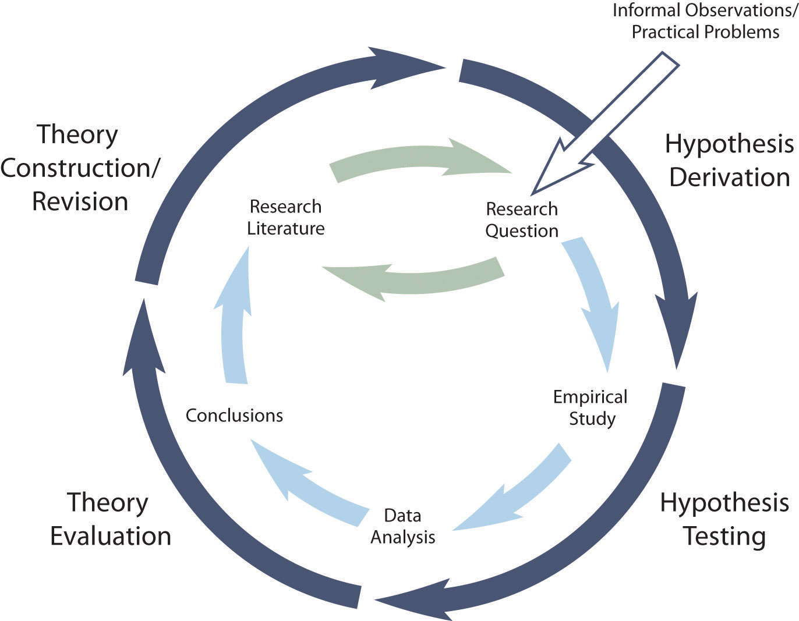

### Using Posit to identify an initial set of literature

Most of us use Google Scholar to find research liteature. However, there are a host of computational tools that we can use to conduct a literature scan or go more in-depth to conduct a systematic literature review.

Part of this process is related to the important process of using the literature to help us build theory.



To that end, good research requires knowledge of the peer-reviewed literature. 

## OpenAlex

We will use OpenAlex to support your literature identification process. OpenAlex is a comprehensive open catalog of the global research system that can help you find relevant publications for your research. 

Once you are set up in R from [part 1](parts/part01.qmd), we'll start working with the code below:

```{r}
#install.packages("openalexR")
library(openalexR)
```

```{r}
# Search for works related to your social justice topic
works_search <- oa_fetch(
  entity = "works",
  title.search = c("BlackCrit", "youth"),
  from_publication_date = "2026-03-01",
  options = list(sort = "cited_by_count:desc"),
  verbose = TRUE
)

# Display the top results
works_search |>
  head(10) |>
  show_works() |>
  knitr::kable()
```

## Web of Science (WoS)

We can also use the WoS to conduct a full systematic literature review with the [`Quanteda`](https://quanteda.io/){target="_blank"} package. 

Web of Science (WoS) is a comprehensive and highly respected citation database used for scholarly research.
It is one of the main databases used to identify and compare collections of citations and bibliographic sources.
Given the conceptual replication method selected for this study, we utilized the Web of Science Core Collection of bibliometric data.
This decision provided us with an opportunity to understand differences across disciplinary boundaries, despite the increasingly interdisciplinary nature of research on racism in STEM.
Prior studies have analyzed differences between Google Scholar and WoS.
Unlike Google Scholar, the Web of Science Core Collection offers access to multiple citation indexes, covering a wide range of academic disciplines and publication types, making it an ideal resource for data collection and analysis.

For this section, I will walk us through a sample study conducted with two graduate students on [notions of racism in STEM](https://rpubs.com/professornaite/notions-of-racism){target="_blank"}.

**[insert table: Results of title keyword search]**

| **Keyword**   | **EBSCO** | **Google Scholar** | **Scopus** | **Web of Science** |
|---------------|:---------:|:------------------:|:----------:|:------------------:|
| anti-racism   |    381    |       3,420        |    685     |        592         |
| anti-racist   |    427    |       3,620        |    826     |        685         |
| race          |  44,057   |     \~313,000      |   65,203   |       69,537       |
| racial        |  24,467   |     \~212,000      |   39,930   |       41,527       |
| racialization |    519    |       2,740        |   1,108    |       1,077        |
| racialized    |    958    |      \~5,600       |   1,863    |       2,120        |
| racism        |   8,669   |      \~99,500      |   11,418   |       10,674       |
| racist        |   1,965   |      \~15,100      |   2,170    |       1,906        |

Systematic review techniques offer a structured approach to synthesizing research literature.
New computational methods have significantly advanced systematic reviews, helping with more pre-defined protocols outlining the methodologies that should be undertaken for reproducibility.
These approaches employ a comprehensive, detailed search strategy across multiple databases and sources to find relevant studies.
Systematic reviews also utilize specific, pre-defined inclusion and exclusion criteria for studies, whereas more critical reviews may rely on subjective or seemingly unclear selection criteria due to content- or disciplinary-specific knowledge.
This often ignored but critical aspect of systematic reviews requires a rigorous assessment of its contribution to and limitations around study quality and risk of bias.

```{r, include=T, message=F, warning=F}
## set up, load libraries
library(dplyr)
library(readtext)
library(tidyverse)
library(here)
library(gt)
library(ggplot2)
library(dplyr)
library(knitr)
library(readr)
library(kableExtra)
library(bibliometrix)
library(tidyverse)
library(DiagrammeR)
library(DiagrammeRsvg)
library(rsvg)
library(quanteda)
library(stringr)
library(tidytext)
library("quanteda.textmodels")
library("quanteda.textstats")
library("quanteda.textplots")
require(quanteda.corpora)
here::i_am("part02.qmd")
```

# RESEARCH QUESTIONS

1.  What is the intellectual and conceptual structure of research on racism in science, technology, engineering, and mathematics (STEM)?

2.  How are notions of racism in the research on STEM distributed across different racialized social systems?

### Scoping

The data for the study comes from the Web of Science (WoS) Core Collection.
Our initial scoping process included a set of iterative steps to make sense of the global research literature on the various notions of racism in STEM.
We prioritized three citation indexes in our searches between the period from 2015 to 2024.
Our analysis focused on journal articles written in English in the Education, Special Education, and related Education Scientific Disciplines.

-   Science Citation Index Expanded, SCI-EXPANDED (2002-present)
-   Social Sciences Citation Index SSCI (2002-present)
-   Arts and Humanities Citation Index ACHI (2002-present)
-   Emerging Sources Citation Index ESSI (2012-present)

Timespan: 2014-01-01 to 2024-12-31

Document Types: Article

### Inclusion and Exclusion Criteria

| Code | Criteria |
|----|----|
| IC1 | Article contains STEM and one of the notions in the title (TI) or abstract (AB): racism, "white supremacy," colonialism, xenophobia, nationalism, antiasian, anti-Asian[\*], antiblack, Anti-Black[\*] |
| IC2 | Article published between 2014 and 2024 |
| IC3 | Article originally written in English |
| IC4 | Article is a journal article |
| IC5 | Article purpose or core questions center on the topical subjects of analysis |

: Inclusion and exclusion criteria for the study


### Review

Key Columns of Interest:

-   AU: Authors of the publication

-   AB: Abstract text

-   TI: Title of the publication

-   AU_CO: Countries of the authors

-   SC: Subject categories (e.g., "Education & Educational Research")

-   PY: Publication year

-   TC: Total citations

# FINDINGS

```{r, echo=FALSE, message=F, warning=F}

M4 <- convert2df(
  file = "../data/racism-in-stem.txt",
  dbsource = "wos",
  format = "plaintext"
)

dim(M4)

# create an object of the study results
results <- biblioAnalysis(M4, sep = ";") # entire data set

options(width=100)
S <- summary(object = results, k = 10, pause = F)
```

## Descriptive (performance) analysis

Summary of the data set and documents.

### Publication-related metrics

#### Main information

Main information about the collection.

```{r, message=F, warning=F}

S[2] # Main information

```


#### Publications by year

```{r, message=F, warning=F}

S[3] # Article count by year

```

```{r, message=F, warning=F}

year_counts <- M4 %>%
  group_by(PY) %>%
  summarise(count = n())

# Your existing plot code
pubs_by_year <- ggplot(year_counts, aes(x = PY, y = count)) +
  geom_col(fill = "steelblue") +
  geom_text(aes(label = count), 
            position = position_dodge(width = 0.9), 
            vjust = -0.5, 
            size = 3) +
  geom_smooth(method = "loess", se = FALSE, color = "blue", size = 0.5, linetype = "dotted") +
  theme_minimal() +
  labs(x = "Year", y = "Number of Publications", 
       title = "") +
  scale_x_continuous(breaks = seq(min(year_counts$PY), max(year_counts$PY), by = 1)) +
  theme(axis.text.x = element_text(angle = 45, hjust = 1))

pubs_by_year

# Save the plot as a high-resolution PNG
#ggsave("plots/publications_by_year.png", plot = pubs_by_year, width = 10, height = 8, units = "in", dpi = 300, bg = "white")
```


#### Most productive authors

```{r, message=F, warning=F}

S[5] # Most productive authors

```

#### Most cited papers

```{r, message=F, warning=F}

S[6] # Most cited papers

```

#### Main sources

```{r, message=F, warning=F}

S[9] # Main sources (journals)

```

### Citation-related metrics

#### Most frequently cited documents

The top 21 most cited papers.
A total of 21 papers was chosen based on ties with the top 15 (8 citations).

```{r, message=F, warning=F}

# M4$CR[1] # identify separators
# Most frequently cited documents in the collection
CR <- citations(M4, field = "article", sep = ";")
cbind(CR$Cited[1:21])
```

### Keywords and Keywords Plus

#### Author Keywords and Keywords-Plus

```{r, message=F, warning=F}

S[10] # Author Keywords and Keywords-Plus

```

#### Keyword Occurence Network

```{r, message=F, warning=F}

# Classical keyword co-occurrences network
NetMatrix1 <- biblioNetwork(M4, analysis = "co-occurrences", network = "keywords", sep = ";")

# statistics for the network
netstat1 <- networkStat(NetMatrix1)
summary(netstat1, k=10)

# Plot the network
set.seed(3)
net1a = networkPlot(NetMatrix1, 
                   n = 25,  # Limit to top 25 keywords
                   normalize = "association",
                   Title = "Top Keyword Co-Occurrences", 
                   type = "circle", 
                   size = TRUE, 
                   remove.multiple = FALSE,
                   labelsize = 0.7,
                   cluster = "none")

net1b = networkPlot(NetMatrix1, 
                   n = 30,  # Even fewer nodes
                   normalize = "association",
                   Title = "Keyword Network", 
                   type = "kamada", 
                   size = TRUE, 
                   remove.multiple = TRUE,
                   labelsize = 0.5,
                   cluster = "louvain")

net1c = networkPlot(NetMatrix1, 
                   n = 30,  # Even fewer nodes
                   #normalize = "association",
                   #weighted = T,
                   Title = "Keyword Co-Occurence Network", 
                   type = "fruchterman", 
                   size = TRUE, 
                   remove.multiple = TRUE,
                   labelsize = 0.5,
                   cluster = "louvain")
```

### Conceptual Structure Map

## Conceptual Structure

```{r, message=F, warning=F}
suppressWarnings(CS1 <- conceptualStructure(M4,
                                            method="MCA", 
                                            field="ID", 
                                            minDegree=15, 
                                            clust=5, 
                                            stemming=FALSE, 
                                            labelsize=15,
                                            documents=20)
                 )
```

```{r, message=F, warning=F}

# Conceptual Structure using keywords (method="CA")
CS <- conceptualStructure(M4,field="ID", method="CA", minDegree=4, clust=5, stemming=FALSE, labelsize=10, documents=10)

CS <- conceptualStructure(M4, 
                           field="ID", 
                           method="CA", 
                           minDegree=4, 
                           clust=5, 
                           stemming=FALSE, 
                           labelsize=10,  # Set to 0 to remove labels
                           documents=10)
# Extract coordinates and clusters
coords <- CS[[1]]  # Coordinates
clusters <- CS[[2]]  # Cluster assignments

CS[4]
```

```{r, message=F, warning=F}

# Create a historical citation network
options(width=130)
histResults <- histNetwork(M4, min.citations = 5, sep = ";")
```

```{r, message=F, warning=F}

# Plot a historical co-citation network
net <- histPlot(histResults, n=15, size = 8, labelsize=4)
```

```{r, message=F, warning=F}

# LEXICAL PATTERNS
# keywords in context
M4_abstract <- corpus(M4$AB)
# M4_abstract
toks_M4_abstract <- corpus_subset(M4_abstract) %>% 
  tokens()

toks <- toks_M4_abstract
toks_clean <- tokens(toks, 
               remove_punct = TRUE, 
               remove_numbers = TRUE) %>%
        tokens_remove(stopwords("english"))

```

### Top token frequencies

```{r, message=F, warning=F}

# Top token frequencies
top_tokens <- toks_clean %>%
  tokens_group() %>%
  dfm() %>%
  textstat_frequency(n = 20)
top_tokens %>%  # top tokens from abstracts
  filter(feature != "research") %>% 
  filter(feature != "study") %>% 
  filter(feature != "article") %>% 
  filter(feature != "also") %>% 
  filter(feature != "can")

```


